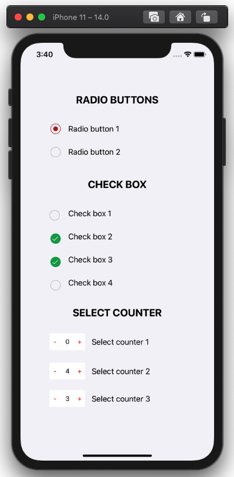

# DMComponents

Um pequeno app para aprender a criar componentes. 

## Descrição

Tive que fazer 3 tipos de componentes: radio, checkbox e um contador. Então criei um app separado do projeto para aprender e manter as classes genéricas.

### Requerimentos

* Swift 5.0
* Xcode 10.0+
* iOS 13.6+

### Uso

  * Para utilizar o radio ou checkbox você deve: 
      1. Incluir um botão na view;
      2. Alterar o tipo do botão para ` Custom `;
      3. Alterar a ` Custom Class ` para ` DMRadioOption ` ou ` DMCheckBox `;
      
  * Para utilizar o contador você deve: 
      1. Incluir uma view dentro da sua viewController;
      2. Alterar a ` Custom Class ` para ` DMSelectCounter `;
      
  * E siga o exemplo:
      
  ```swift
class ViewController: UIViewController, DMRadioOptionDelegate, DMCheckBoxDelegate, DMSelectCounterDelegate {
    @IBOutlet weak var radioButton: DMRadioOption!
    @IBOutlet weak var checkBox: DMCheckBox!
    @IBOutlet weak var selectCounter: DMSelectCounter!
    
    override func viewDidLoad() {
        super.viewDidLoad()
        radioButton.delegate = self
        checkBox.delegate = self
        selectCounter.delegate = self
    }
  ```
  
### Screenshot

<table style="width:100%">
  <tr>
    <td></td>
  </tr>
</table>

### Autora

| [](https://github.com/laridtm/) | [@laridtm](https://github.com/laridtm/) |
| ------ | ------ |
